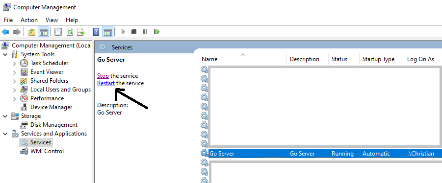
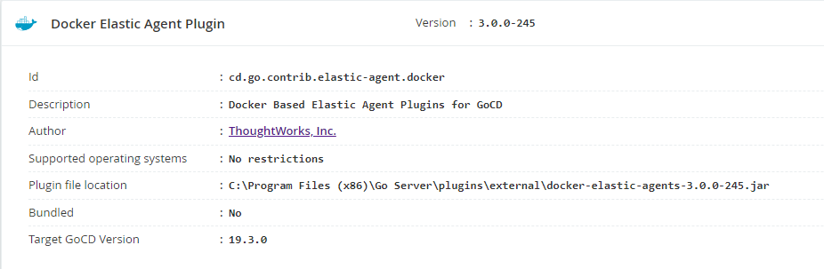
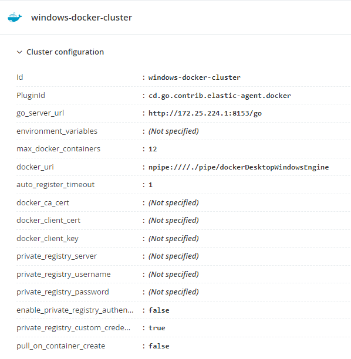
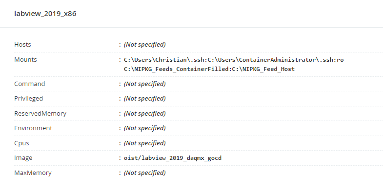
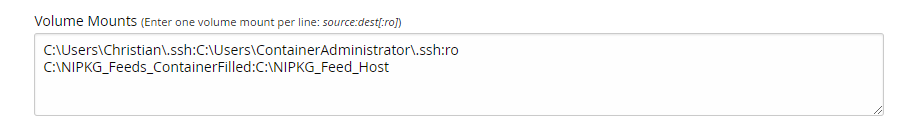

# Instructions for use with GoCD

Some key points on the use with GoCD of the images built using the Dockerfiles in this repository are given below.
If using these images with a different build system, then these points might be illustrative, but would need adaptation (and different screenshots!)

If you would like to provide platform-specific advice for a different platform with these images, then please feel free to open a PR or contact Christian Butcher.

## Use of SSH Keys

## Elastic Agents and the Elastic Agent Plugin

The "Docker Elastic Agent Plugin" is not bundled with a default GoCD installation.
Since all of the following instructions assume that the containers will be used as "elastic agents", the use of this plugin is required (at least for these instructions to be relevant).

### Installation
To install the plugin, go to the [GoCD plugin page](https://www.gocd.org/plugins/) and navigate to "Elastic Agent Plugins", selecting "GoCD Elastic agent plugin for Docker".

Other plugins are available for other platforms/tools, for example Kubernetes, OpenStack, Azure - but these are not discussed further here. If you want to try those and have success (or failure), please get in touch!

Instructions for installation are available from the GoCD website, but are basically to download the plugin JAR file and place it in the `plugins/external` folder of the server installation, for example `C:\Program Files (x86)\Go Server\plugins\external`, and then restart the server (if running as a Windows service, this can be done via the Windows Services app or via the Computer Management tool).



After installation, the plugin should appear in the list of plugins at `<server_host>/go/admin/plugins`



### Server Configuration

#### Cluster settings

The server-wide configuration for the Docker agents is done at the ADMIN > Elastic Agents Configuration page (`/go/admin/elastic_agents_configuration`).

Here a "cluster" is configured, and settings that apply to all containers created for that cluster are provided.
The cluster settings for the profile used in the GDevCon 2022 presentation are shown below for reference - the named pipe is used to access the host Docker engine.
The go_server_url value is the IP address of the host from the point of view of the containers, and can be acquired by running `ipconfig /all` and searching for the "(nat)" adapter (using the default names provided by Docker), but might also have no real effect in this configuration. If the server and the agents are not on the same device, then both these settings would be different.

The following PowerShell command also produces the IP address othat adapter, and can be adjusted for other names:
```
> (Get-NetIPAddress -InterfaceAlias "vEthernet (nat)" -AddressFamily "IPv4").IPAddress
```



The `max_docker_containers` setting can be chosen based on whatever parameter forms the bottleneck in your setup - in my testing, RAM was often the most problematic (each container takes ~1.5-2GB of RAM for my build processes).

#### Profile settings

Each cluster can contain multiple "elastic profiles". 
For the GDevCon 2022 presentation, I used 3 profiles, each referencing a different image but the same volume mounts.
The settings are shown below for the overview of one profile, and the configuration of the volume mounts (via the edit page).




Here my Windows host SSH keys are mounted into the container, and a directory on the host (`C:\NIPKG_Feeds_ContainerFilled`) is mounted at `C:\NIPKG_Feed_Host` in the containers.
This allows easy publication of the built nipkg files into a persistent filesystem, although tools like Docker volumes could also potentially be used.

In the future, use of a webservice which accepts the nipkg files and handles the NIPM feed might be preferable, but requires significantly more infrastructure.

I was unable to mount a non-local drive into the Docker containers, but with this configuration it is possible to trigger publication from the Docker host to a network shared drive or similar after builds are completed.

Mounting volumes in this way only worked with my Docker Desktop client in Linux containers mode, so the use of contexts (as described in the [README](../README.md)) is suggested.

### Behaviour and usage

Each agent is only used for one build task via this plugin, but the time taken to reclaim the agent after a build finishes can introduce a delay between consecutive builds. This reduces the number of jobs that can be completed in a given time.

A separate plugin is used to publish NIPKG files - for details about that plugin, see its repository at https://github.com/oist/Chakraborty_NIPKG_GoCD.
